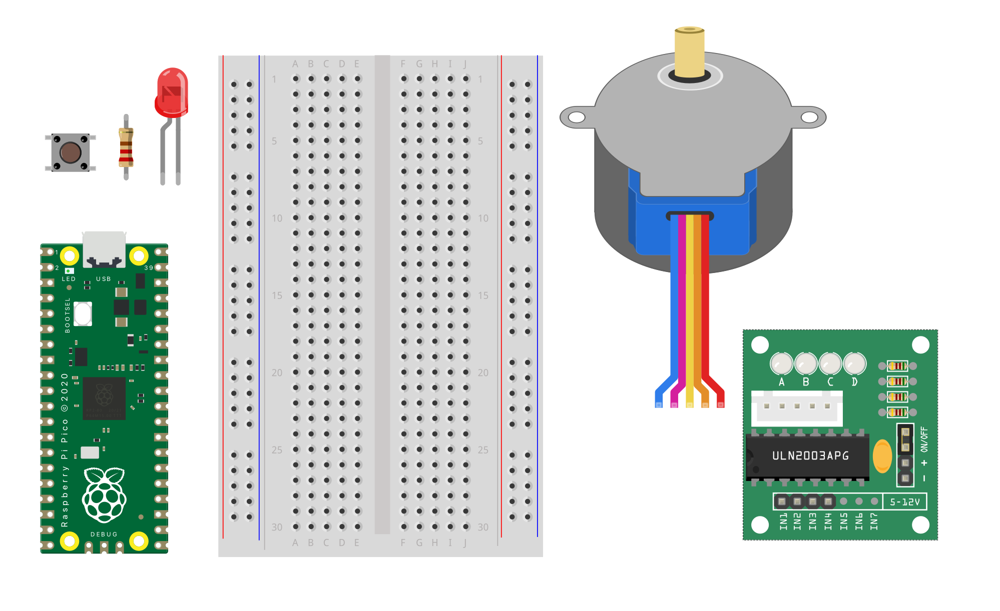

## What you will make

**Time to Make** is a spinning selection wheel made from cardboard and a stepper motor. It randomly selects one of four options each time it turns.

You can make your own version! Yours could:
- ask quiz questions
- get yes or no answers
- generate story ideas
- or decide chores like who cooks

See the wheel in action. Sound on 🔊
<html>

<iframe style="position: absolute; top: 0; left: 0; right: 0; width: 100%; height: 100%; border: none;" src="https://www.youtube.com/embed/RpSMp2ecpjI?rel=0&cc_load_policy=1" allowfullscreen allow="accelerometer; autoplay; clipboard-write; encrypted-media; gyroscope; picture-in-picture; web-share">
</iframe>

 
</html>

### You will need for the circuit:
- Computer with Thonny installed
- Raspberry Pi Pico and a micro USB cable
- Breadboard
- Pin-to-pin and socket-to-pin wires
- Stepper motor and driver
- Button
- LED and a 220Ω resistor

{:width="500px"}

### For the device:
- Cardboard box such as a shoe box, or cardboard to make a box
- Cardboard to make the wheel and spacer circles
- Pencil
- Scissors
- Sticky tape
- Glue (optional)
- Materials to decorate (such as pens, paint, or coloured stickers or paper)
