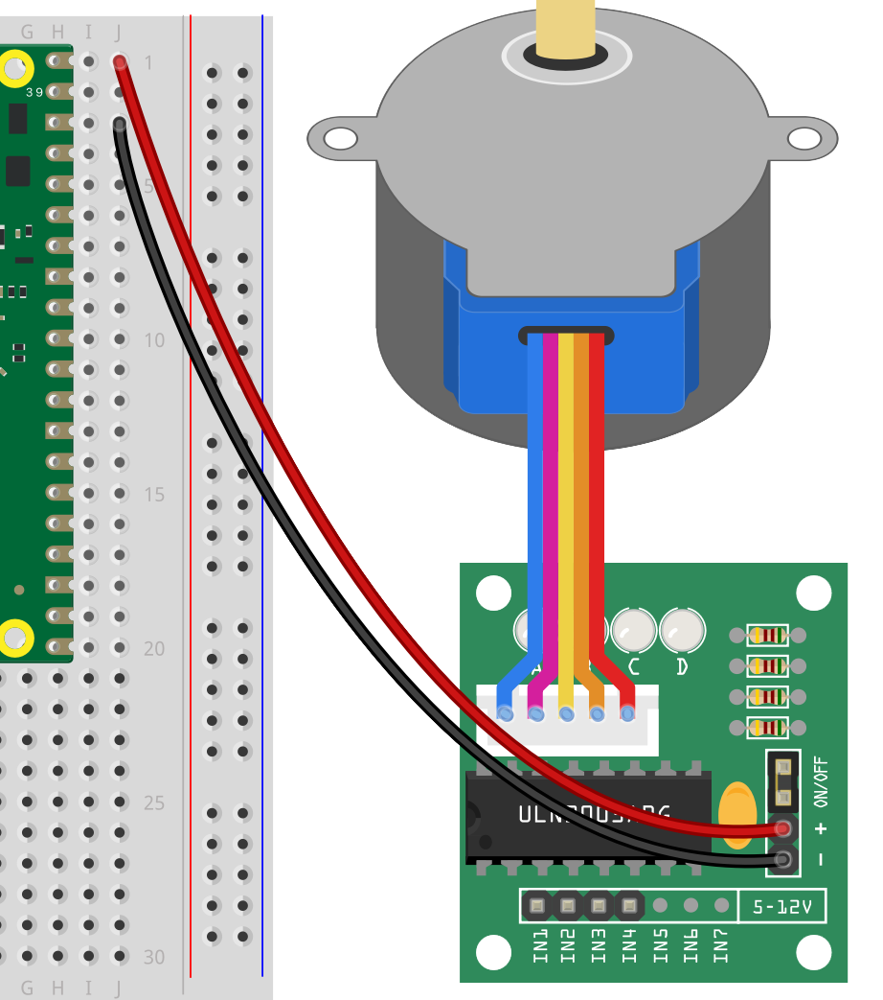
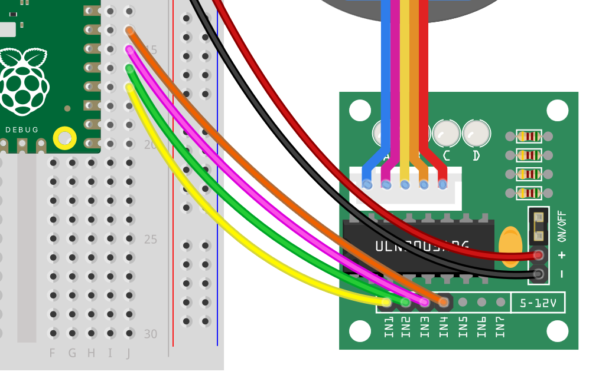

## Stepper motor working

--- task ---
pico on breadboard
{:width="500px"}
--- /task ---

--- task ---
stepper into the driver
{:width="500px"}
--- /task ---

--- task ---
plug + - driver into pico
{:width="500px"}
{:width="500px"}
--- /task ---

--- task ---
plug other pins of driver into pico
{:width="500px"}
{:width="500px"}
--- /task ---

--- task ---
get thonny working 
ADD link to the intro to pico or dropdown menu
--- /task ---

--- task ---
improt libraries - CODE
--- /task ---

--- task ---
get code stepper to move 90 - CODE
--- /task ---

--- task ---
Test
--- /task ---

