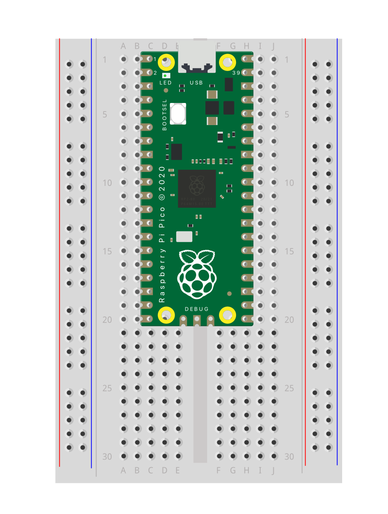
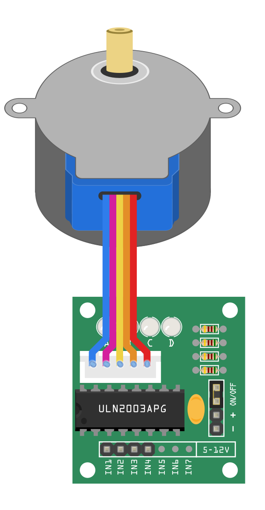
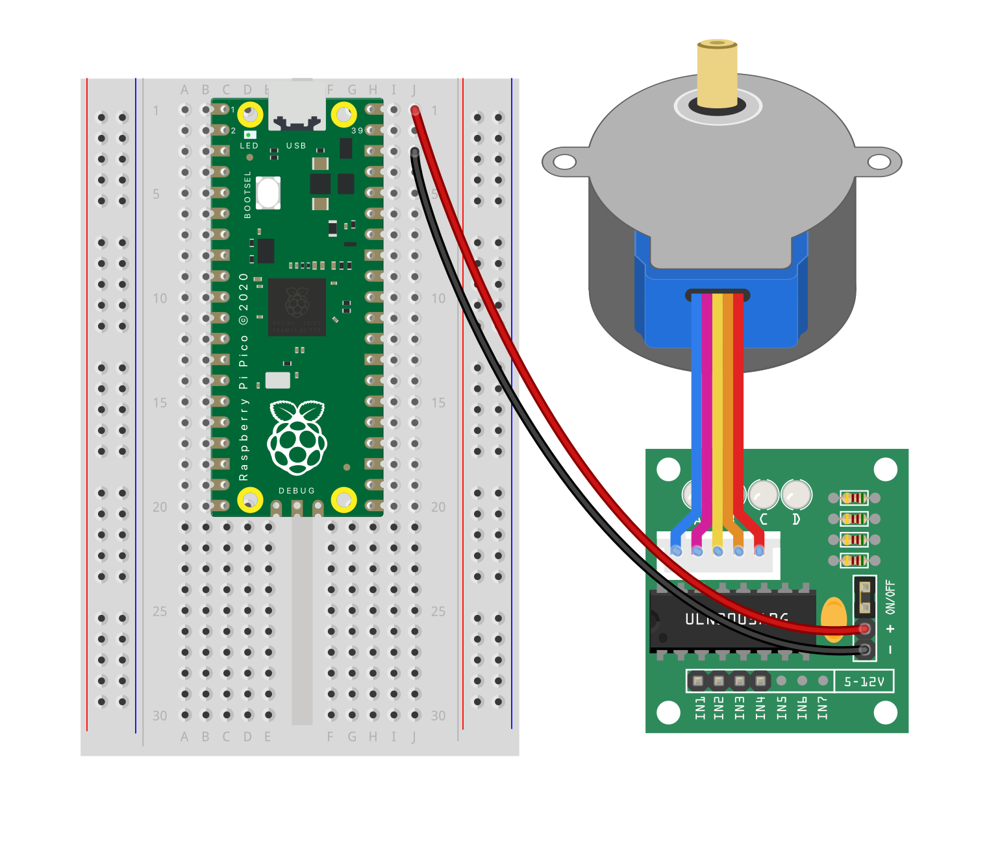
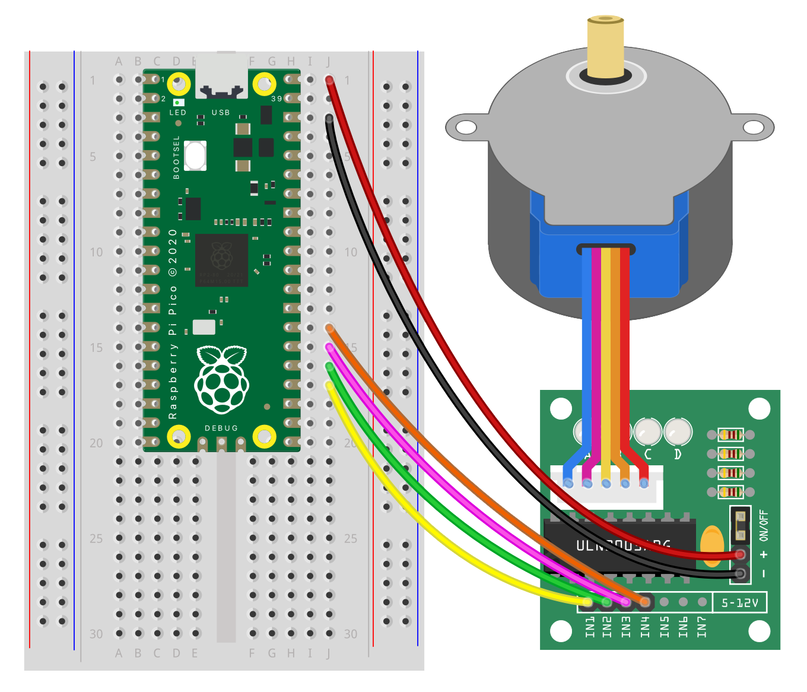

## Wire the motor

--- task ---

Insert your Raspberry Pi Pico into the breadboard.
{:width="300px"}

--- /task ---

--- task ---

Insert the stepper motor wires into the driver.

**Tip:** Drivers vary. If your driver looks different to this, skip the rest of this step and look up where the wires go for your specific driver.

{:width="300px"}

--- /task ---

--- task ---

To power the driver, first, add a wire from **+** on the driver to **VBUS** on the Raspberry Pi Pico. 

Then, add a wire from **-** on the driver to **GND** on the Raspberry Pi Pico.

{:width="500px"}

--- /task ---

--- task ---

Add wires to connect the pins of the driver to the Raspberry Pi Pico:
- Driver pin **1** to **GP18**
- Driver pin **2** to **GP19**
- Driver pin **3** to **GP20** 
- Driver pin **4** to **GP21**

{:width="500px"}

--- /task ---