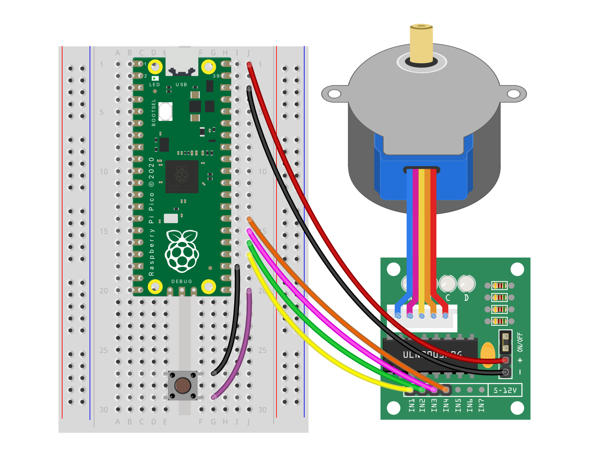
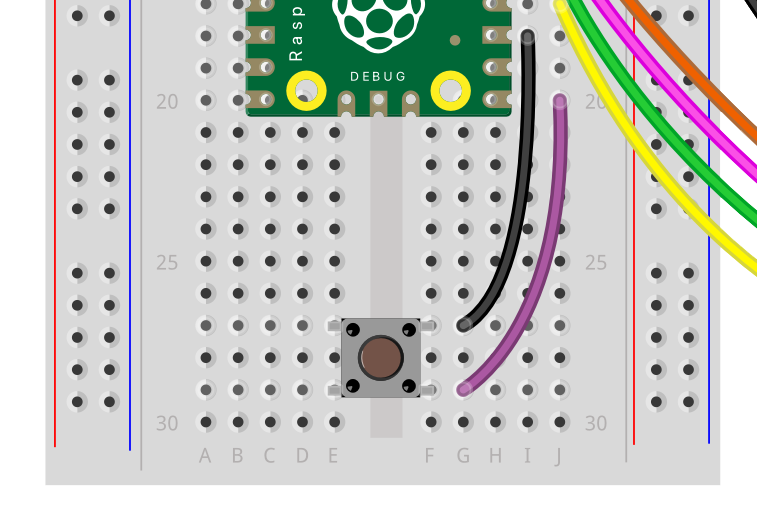

## Add button and pressed

--- task ---
add button to breadboard
{:width="500px"}
{:width="500px"}
--- /task ---

--- task ---
make the stepper thing into a function
CODE
--- /task ---

--- task ---
call the function on button
CODE
--- /task ---

--- task ---
Test
--- /task ---
