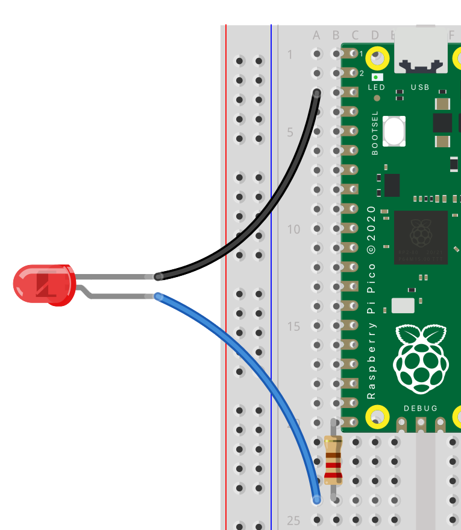

## Add LEDs

--- task ---
add leds
{:width="500px"}
{:width="500px"}
--- /task ---

--- task ---
make a flashy function
CODE
--- /task ---

--- task ---
add to call when button pressed
CODE
--- /task ---

--- task ---
Test
--- /task ---

