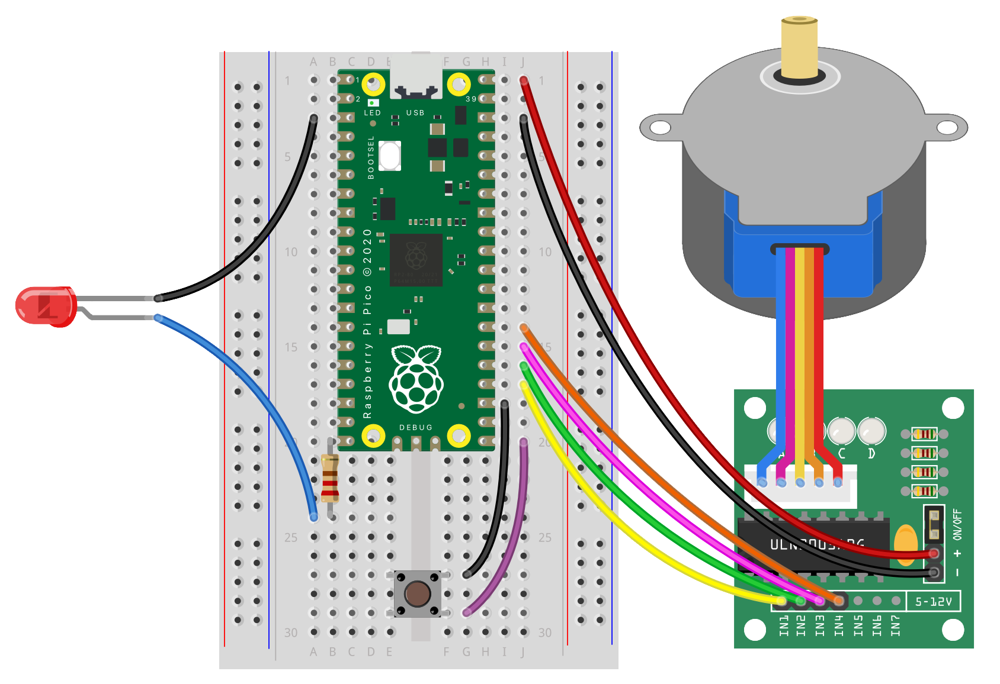

## Add an LED

--- task ---
Add an LED amd a 220Ohm resistor to the breadboard.

Put one resistor leg into GP15 (20) in the Pico, and the other into a free row in the breadboard.

Add a socket to pin wire from the same row in the breadboard to the long LED leg.

Add a black socket to pin wire from the shorter LED leg to GND (3) on the Pico.

{:width="500px"}
--- /task ---

--- task ---
Import the 'DigitalLED' from the picozero library.

--- code ---

---
language: python
filename: main.py
line_numbers: true
line_number_start: 1
line_highlights: 1
---
from picozero import Pot, Button, DigitalLED
from time import sleep

#define pins
stepper = Stepper((18, 19, 20, 21))
button = Button(15)

while True:
    if button.is_pressed:
        #rotate motor
        stepper.rotate(90, 'cw')
--- /code ---
--- /code ---

--- /task ---

--- task ---
Define the LED pin

--- code ---
---
language: python
filename: main.py
line_numbers: true
line_number_start: 1
line_highlights: 7
---
from picozero import Pot, Button, DigitalLED
from time import sleep

#define pins
stepper = Stepper((18, 19, 20, 21))
button = Button(15)
led = DigitalLED(14)

while True:
    if button.is_pressed:
        #rotate motor
        stepper.rotate(90, 'cw')
--- /code ---

--- /task ---

--- task ---
Make the LED blink. 

Experiment with the length of time on and off by changing the numbers in the brackets

--- code ---
---
language: python
filename: main.py
line_numbers: true
line_number_start: 1
line_highlights: 11
---
from picozero import Pot, Button, DigitalLED
from time import sleep

#define pins
stepper = Stepper((18, 19, 20, 21))
button = Button(15)
led = DigitalLED(14)

while True:
    if button.is_pressed:
        led.blink(0.3,0.3)
        #rotate motor
        stepper.rotate(90, 'cw')
--- /code ---

--- /task ---

--- task ---
**Test:** Press the button and watch the motor turn and the LED blink.
--- /task ---

