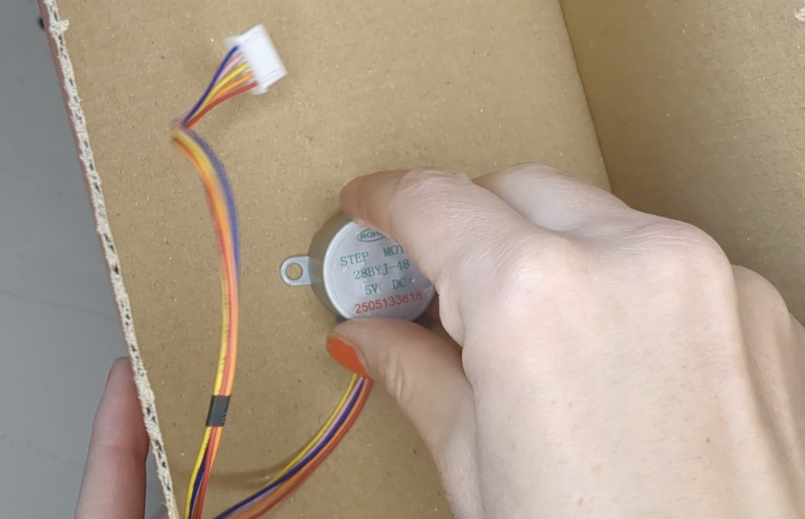

## Make the box

--- task ---
Find a small box. A shoe box is a good size, or simiarl size packageing.

Mark the centre of the box with a pen and make a hole in the box

--- /task ---

--- task ---
Unplug the motor from the driver, and tape the stepper it to the inside of the box. 

Poke it through the hole. You can see it on the outside.

--- /task ---

--- task ---
add something about meauring so that it fitsß
cut out dial - make sure that it will turn with the box

--- /task ---

--- task ---
cut out a window and a hole in the cetnre

--- /task ---

