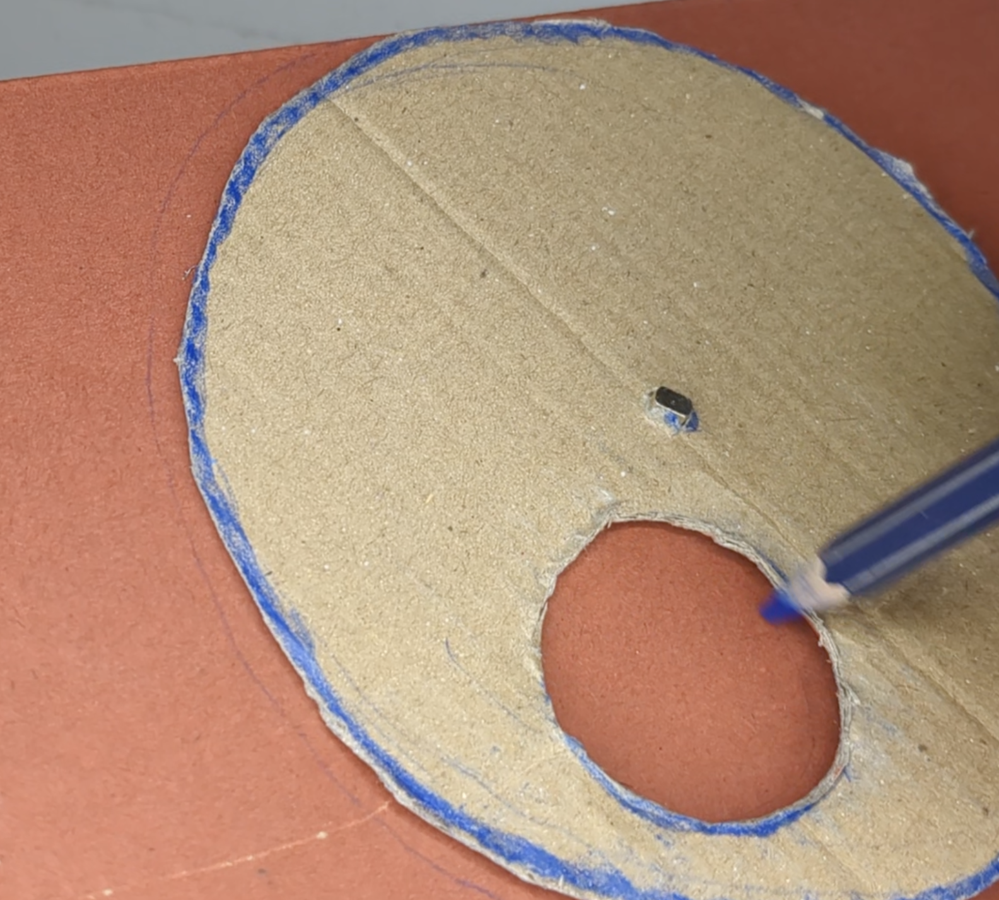
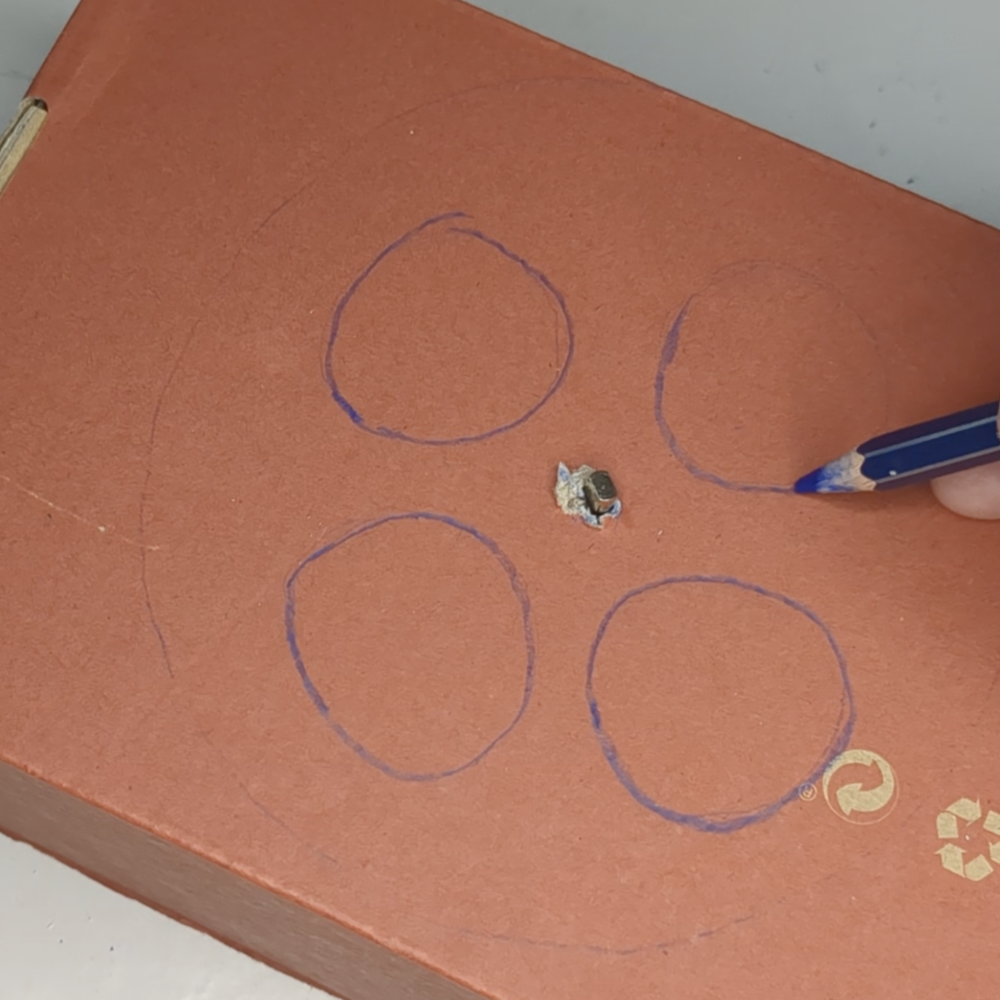

## Decorate
--- task ---
draw round on the box
measure 4 so they are more exact (than I did!)

--- /task ---

--- task ---
Decorate the box and add text, make a little bit smaller so room for a bit of error

--- /task ---

