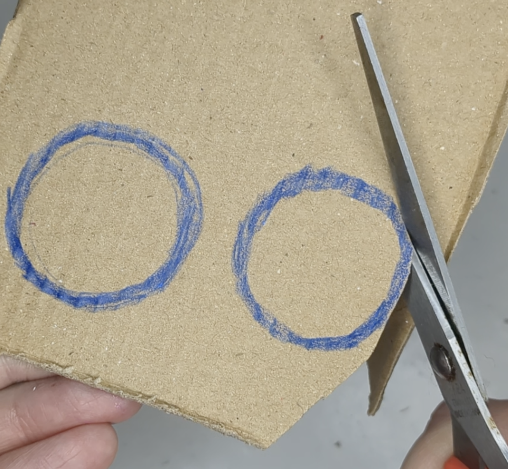
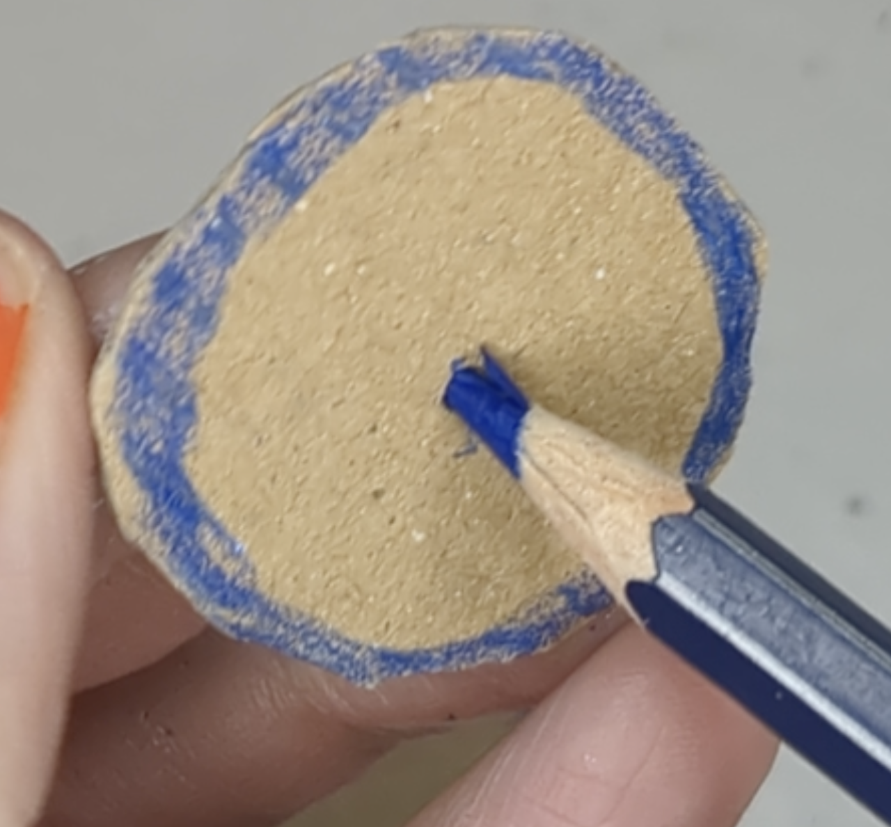

Attach the wheel

--- task ---
Cut out two small spacer circles from card. These are used to space the wheel away from the box.

Add two small holes.

**Tip:** make sure you can't see the spacer circles through the wheel.
--- /task ---

--- task ---
Glue the spacer circles together. 

Attach them onto the stepper motor shaft with glue or tape.

--- /task ---

--- task ---
Decorate the wheel.

Attach it to the spacer circles with tape or glue.

--- /task ---

--- task ---
Unplug the LED and glue or tape it to the box. 

**Tip:** The LED should fit under the wheel because of the spacer circles, but you can add it anywhere eon the box.

--- /task ---

--- task ---
Carefully move the wheel and stepper motor shaft, so that it is over one of the words

--- /task ---

--- task ---
Plug the LED and stepper motor back into the breadboard and try it out! 

**Tip:** you could store the breadboard inside the box.

--- /task ---

--- task ---
**Test:** Press the button and watch your decorated dial turn while the LED blinks
--- /task ---