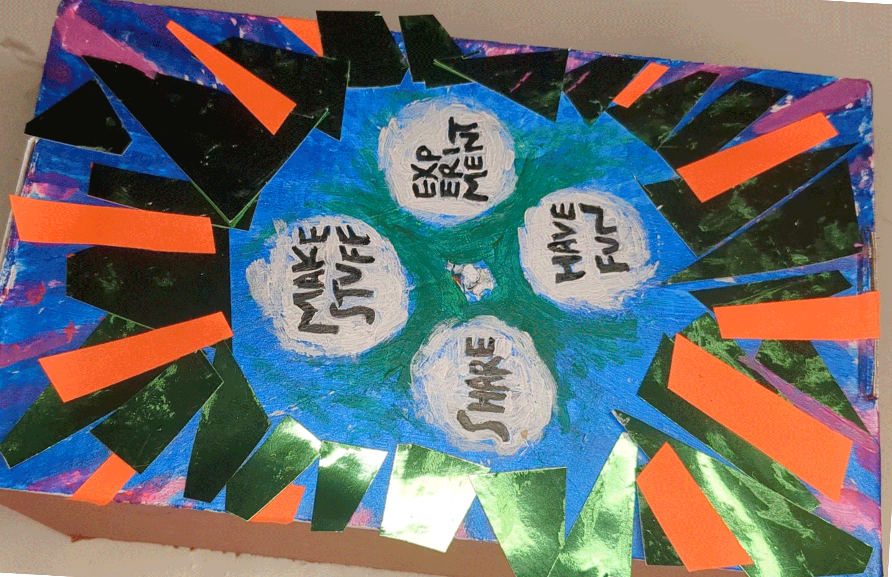

## Attach the wheel

--- task ---
Cut out two small spacer circles from a piece of cardboard. You will use these to space the wheel away from the box.

Make a hole in the centre of each spacer circle with a sharp pencil.

{:width="500px"}
{:width="500px"}

**Tip:** Make sure that you cannot see the spacer circles through the wheel.
--- /task ---

--- task ---
Glue the spacer circles together. 

Attach them to the stepper motor shaft with glue or tape.
{:width="500px"}
--- /task ---

--- task ---
Decorate the wheel however you like.

Then, attach the wheel to the spacer circles with tape or glue. If the wheel feels loose, you could add some sticky tack or a small amount of hot glue to make it more secure.

{:width="500px"}
{:width="500px"}
--- /task ---

--- task ---
Unplug the LED and glue or tape it to the box. 

**Tip:** The LED should fit under the wheel because of the spacer circles, but you can add it anywhere you like on the box.
{:width="500px"}
--- /task ---

--- task ---
Carefully move the wheel and stepper motor shaft so that the window is positioned over one of the text options.

{:width="500px"}
--- /task ---

--- task ---
Plug the LED and stepper motor back into the breadboard, then try your project! 

**Tip:** You could store the breadboard inside the box.

{:width="500px"}
--- /task ---

--- task ---
**Test:** Press the button and watch your decorated wheel turn while the LED blinks.
--- /task ---